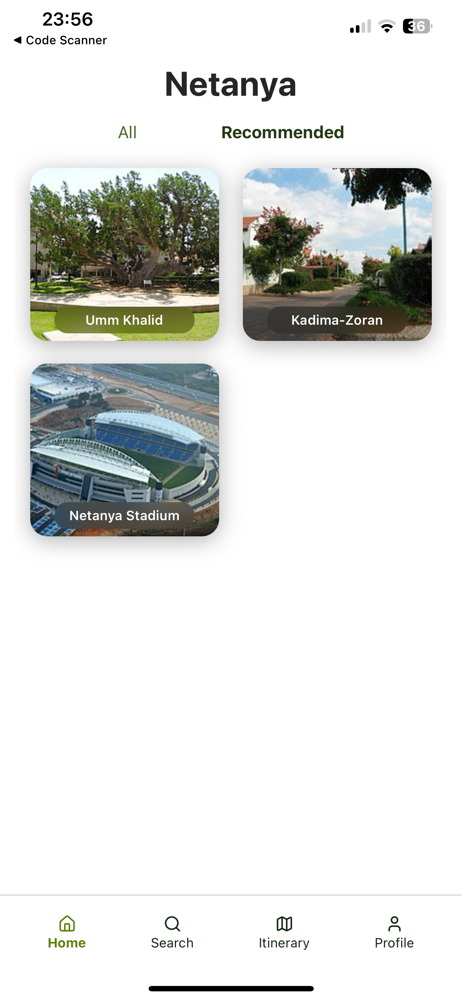
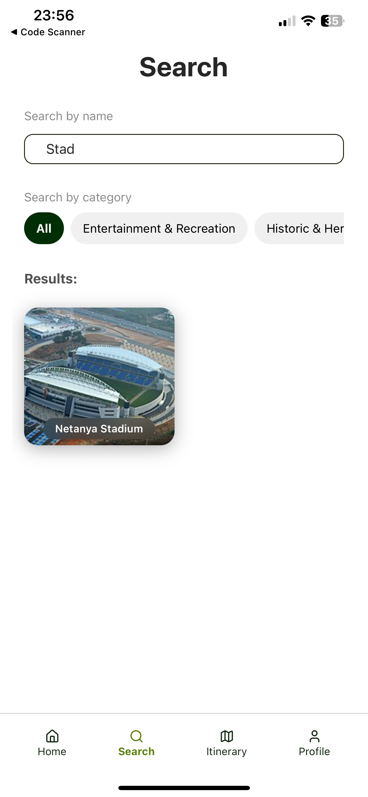
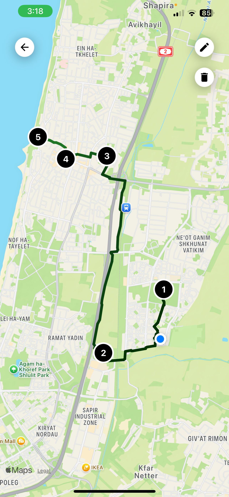
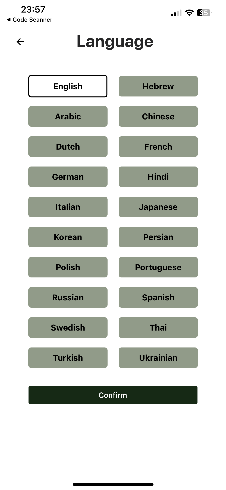
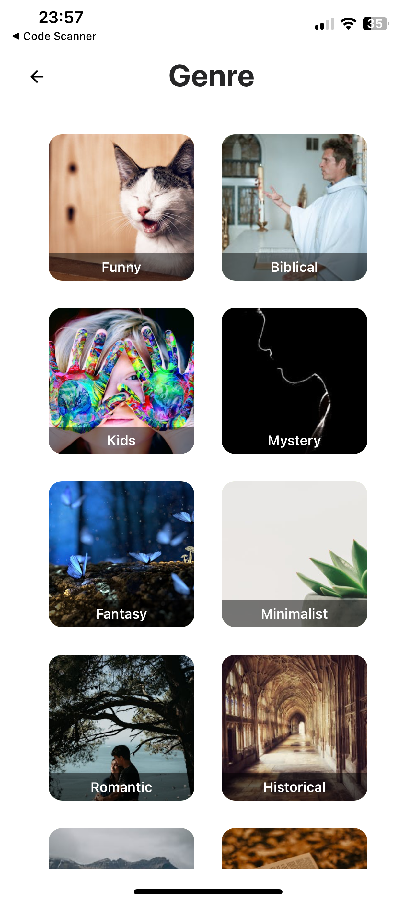
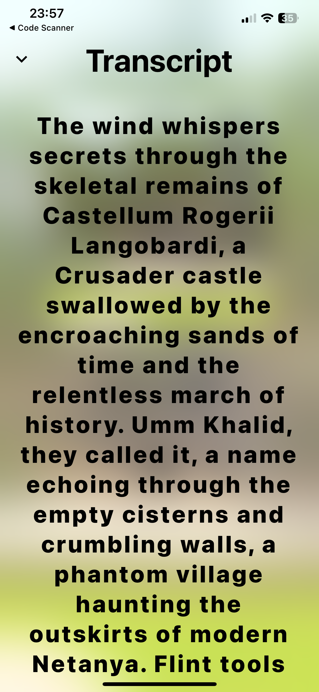

# AI-Powered Travel App

A travel app with personalized recommendations and AI-generated content based on your preferred genre and language.

  

---

## ✅ Features

### 🎯 Personalization
- Select your preferred **genre** (e.g. fantasy, thriller, romance)
- Choose your **language**
- Set your **search radius**
- Manage your **personal profile**, including favorite places and interests

### 📍 Exploration
- Get AI-generated recommendations for nearby landmarks
- Search for landmarks by name or browse by category
- Read or listen to immersive AI-generated **transcripts** with text-to-speech

### 🗺️ Planning
- Receive an automatically suggested route based on recommended locations
- Build a custom itinerary with selected landmarks
- Save and organize your favorite spots for future trips

---

## 🛠️ Tech Stack

- **Frontend:** React Native (with Expo), TypeScript, Gluestack UI, Tailwind CSS (via NativeWind)  
- **Backend:** ASP.NET Core (C#), structured as a RESTful API with layered architecture (Controller, Business Logic, Data Access)  
- **Database:** Microsoft SQL Server, accessed via Stored Procedures

---

## 🌐 APIs & Services

- **MediaWiki API (Wikipedia):** for fetching landmark data (titles, coordinates, descriptions, images)  
- **OpenRouteService API:** for drawing optimized travel routes between landmarks  
- **Gemini (Google AI):** for generating rich, genre-based landmark descriptions

### 📱 Device APIs (via Expo SDK)
- **Expo Location:** for accessing user location and reverse geocoding (city, region)  
- **Expo Speech:** for playing AI-generated transcripts using text-to-speech

---

## 📸 Screenshots

<table>
  <tr>
    <td align="center"><strong>🏠 Home Screen</strong></td>
    <td align="center"><strong>⭐ Recommended Landmarks</strong></td>
    <td align="center"><strong>🔍 Search Screen</strong></td>
  </tr>
  <tr>
    <td></td>
    <td></td>
    <td></td>
  </tr>
  <tr>
    <td align="center"><strong>🗺️ Recommended Route</strong></td>
    <td align="center"><strong>🌐 Language Selection</strong></td>
    <td align="center"><strong>🎭 Genre Selection</strong></td>
  </tr>
  <tr>
    <td></td>
    <td></td>
    <td></td>
  </tr>
  <tr>
    <td align="center"><strong>🔊 Listening Mode</strong></td>
  </tr>
  <tr>
    <td></td>
  </tr>
</table>

---

## 🎓 Final Project

Developed as a final-year Computer Science project by:

- [Barak Doron](https://github.com/barakdo)  
- [Roni Ronen](https://github.com/ronironen)  
- [Or Dahan](https://github.com/ordahann)
